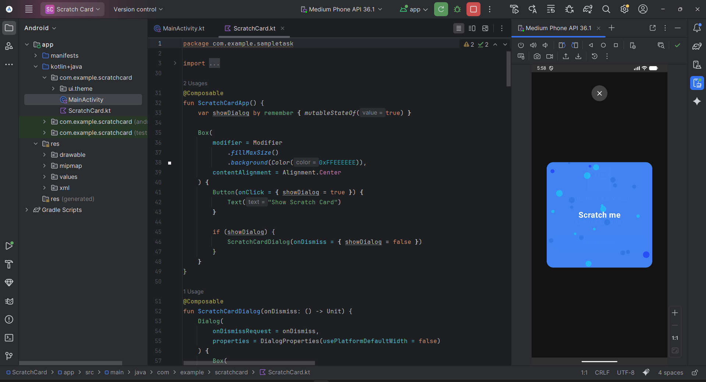

# 🎟️ Android Scratch Card (Jetpack Compose)

A high-performance, interactive **Scratch Card UI** built entirely with **Android Jetpack Compose**. 

This project demonstrates advanced Compose graphics techniques, including custom `Canvas` drawing, `BlendMode` masking, and gesture detection to create a realistic "scratch-to-reveal" experience.

---

## 📱 UI Showcase

| 1. Ready to Scratch | 2. Reward Revealed | 3. Details & Terms |
|:---:|:---:|:---:|
|  |  |  |

---

## 💻 Project Structure & Code

A clean, modular implementation using Jetpack Compose best practices. The code is separated into logical layers: `ScratchCardApp` (Container), `ScratchOverlay` (Drawing Logic), and `RewardContent` (UI).



---

## 🚀 Key Features

* **Realistic Scratch Effect:** Uses smooth path drawing to simulate a real lottery scratch card.
* **Auto-Reveal Logic:** Smart detection algorithms automatically clear the card once the user has scratched ~60% of the surface area.
* **Interactive Animations:**
    * Responsive touch gestures (`detectDragGestures`).
    * Expandable "Terms & Conditions" section with `AnimatedVisibility`.
* **Layered Architecture:** Clean separation of concerns between the **Overlay Layer** (Drawing logic) and the **Reward Layer** (Business logic).

---

## 🛠️ Tech Stack & Concepts

* **Language:** Kotlin 100%
* **Framework:** Jetpack Compose (Material3)
* **Graphics Engine:** * `Canvas` & `Path` for drawing user strokes.
    * `BlendMode.Clear` for the erasing effect.
    * `graphicsLayer` for off-screen compositing.
* **State Management:** `remember`, `mutableStateOf`, and `derivedState`.

---

## 💡 Technical Deep Dive

### How the "Scratch" Effect Works
Standard drawing in Android is additive (adding colors). To achieve an "eraser" effect, I utilized **Porter-Duff blending modes** with a hardware layer trick.

```kotlin
// 1. Force the Overlay into an off-screen buffer
Box(modifier = Modifier.graphicsLayer { alpha = 0.99f }) {
    
    // 2. Draw the Cover (Blue Layer)
    Canvas(modifier = Modifier.fillMaxSize()) {
        drawRect(color = BlueColor)
    }

    // 3. Cut holes using the User's Touch Path
    Canvas(modifier = Modifier.fillMaxSize()) {
        drawPath(
            path = userTouchPath,
            blendMode = BlendMode.Clear // <--- The Magic
        )
    }
}
```

## 🔮 Future Improvements

While the current implementation is solid, here are planned enhancements for V2:

* **Stroke Width Dynamics:** Vary the scratch path width based on touch pressure or velocity.
* **Percentage Calculation:** Replace the "point count" heuristic with exact pixel-alpha analysis for precise 60% revealed calculation.
* **State Persistence:** Use `ViewModel` or `rememberSaveable` to persist the scratch state across screen rotations (configuration changes).
* **Sound Haptics:** Add haptic feedback (vibration) and sound effects during the scratching gesture.
## 🏃 How to Run

1.  **Clone the repository**
    ```bash
    git clone https://github.com/akshatgodson/ScratchCard.git
    ```
2.  **Open in Android Studio** (Ladybug or newer recommended).
3.  **Sync Gradle** to download dependencies.
4.  **Select Device:** Choose an Emulator (Pixel 6/7 recommended) or a physical Android device.
5.  **Run:** Click the green **Run** (Play) button.
